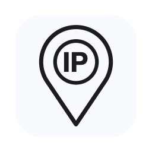
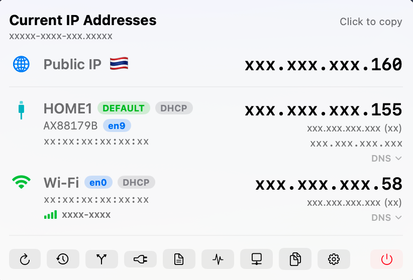

<div align="center">
  
  <h1>IPBar</h1>
  <p>A lightweight macOS <strong>menu bar</strong> app that shows the IP address of
  every active network interface — Wi-Fi, Ethernet, and VPN — plus your public IP
  with reverse DNS, country flag, and ISP.</p>
</div>

## Screenshot

<div align="center">
  
</div>

## Features

- **All interfaces** — enumerated via `getifaddrs()`, with friendly names
  (Wi-Fi / Ethernet) resolved through `SystemConfiguration`.
- **VPN aware** — `utun` / `ppp` / `ipsec` tunnels are detected and tagged **VPN**
  automatically when a tunnel has a routable address.
- **IPv4 is the headline** — the big number is always IPv4. IPv6 is shown as a
  secondary line. If an interface has *no* IPv4, its IPv6 becomes the headline.
- **Public IP + reverse DNS** — shows your public IPv4 (and IPv6 if reachable)
  with the PTR hostname, like `…myaisfibre.com`, plus a country flag and ISP.
- **Resilient public-IP lookup** — provider **fallback chain**
  (ipwho.is → ipinfo.io → ipapi.co for geo/ISP; ipify → icanhazip for the IP)
  with a **cached last-known value** so the flag/ISP never vanish when one
  provider rate-limits.
- **Wi-Fi details** — SSID (with Location access), signal strength + bars,
  channel, band, PHY mode (Wi-Fi 6, etc.), security, and Tx rate, via CoreWLAN.
- **DNS & config** — per interface: the IPv4 **config method** (DHCP / Manual
  badge), plus DNS servers and search domains (the effective, DHCP-provided
  values) behind a tap-to-expand **DNS** disclosure.
- **Network diagnostics** — a popup that pings the gateway and public anchors
  (1.1.1.1 / 8.8.8.8), queries each configured DNS server with `dig`, and times
  a DNS resolution — each with latency + reachability.
- **LAN scanner** — discovers devices on the local network from the ARP cache
  (with reverse DNS and gateway/self tagging); a **Deep Scan** ping-sweeps the
  subnet to find more.
- **Route table / open ports** — sortable popup tables (ports mapped to process).
- **Hosts file editor** — view and edit `/etc/hosts` with an admin auth prompt.
- **Click to copy** — click any address to copy it to the clipboard.
- **Privacy masking** — independent click-to-mask toggles across the panel: the
  **hostname** (tap the header), each interface's **IP / MAC / subnet / gateway /
  DNS** (tap its name), the **public IP + ISP** (tap "Public IP"), and the
  **Wi-Fi SSID / BSSID** (tap the signal icon). Click again to reveal — handy for
  screenshots.
- **History** — records public-IP / primary-interface changes over time.
- **Auto refresh** — re-scans automatically when the network path changes
  (`NWPathMonitor`), plus a manual Refresh button.

Requires macOS 14+, Xcode 16+ (Swift toolchain).

## Build & run

### Option A — Xcode (recommended for development)

```bash
open IPBar.xcodeproj
```

Select the **My Mac** run destination and hit ▶. The app target produces a real
`.app` bundle (bundle id `com.nonbytes.ipbar`, `LSUIElement = YES`), so it runs as
a proper menu-bar-only app and stays resident.

> Don't run the *SwiftPM executable* directly (e.g. `swift run` or hitting ▶ on a
> bare Package target) — without a bundle identifier the menu-bar status item can't
> register and the process exits immediately.

### Option B — command line / SwiftPM

```bash
./build.sh                 # compiles + bundles IPBar.app (ad-hoc signed)
open IPBar.app             # launch (icon appears in the menu bar)
cp -R IPBar.app /Applications/   # install for everyday use
```

### Headless / CLI

```bash
.build/release/IPBar --dump            # interfaces + public IP (Wi-Fi line included)
.build/release/IPBar --routes          # routing table
.build/release/IPBar --ports           # listening ports + owning process
.build/release/IPBar --diag            # DNS servers + ping/dig diagnostics
.build/release/IPBar --lan             # LAN devices from the ARP cache
.build/release/IPBar --lan --deep      # ping-sweep first, then list (~10s)
# or, once installed:
/Applications/IPBar.app/Contents/MacOS/IPBar --dump
```

## How the "headline" rule works

For each interface (and for the public IP):

```
headline = first IPv4  ??  first IPv6      # IPv4 wins; IPv6 only if no IPv4
others   = remaining IPv4 + all IPv6       # shown small, monospaced
```

Link-local IPv6 (`fe80::…`) and loopback are filtered out as noise.

## Project layout

```
IPBar.xcodeproj          Xcode app project (App target → IPBar.app)
Package.swift            SwiftPM manifest (same sources, for CLI builds)
Sources/IPBar/Core.swift Models, getifaddrs scanner, public-IP service, view model
Sources/IPBar/App.swift  @main entry, MenuBarExtra, SwiftUI views
Info.plist               Bundle metadata (LSUIElement = menu-bar-only)
build.sh                 SwiftPM compile + assemble + ad-hoc sign IPBar.app
```

Both build systems compile the **same** `Sources/IPBar/*.swift` and use the same
`Info.plist`, so they stay in sync.

## Settings (⌘, or the gear button)

- **Launch at login** (`SMAppService`)
- **Menu bar shows**: icon only · public IP · local IP (text next to the icon).
  The menu-bar glyph is the same "IP" location pin as the app icon, and fills in
  solid when a **VPN** is active.
- **Auto-refresh**: off / 15s / 30s / 1m / 5m
- **Show Wi-Fi details** (signal, channel, etc.). Reading the **SSID** needs
  Location access (macOS 14+ gates it); the other Wi-Fi fields work without it.
- **Show DNS, search domains & config** (DHCP/Manual badge) — on by default.
- **Show loopback** / **show link-local IPv6** toggles
- **Public IP**: enable/disable the lookup, optional **ISP / country** (resolved
  through a provider fallback chain), and **notify on public-IP change**. Turn
  both off to keep every lookup on-device.

Per interface the panel also shows the **subnet** (`/24`), **gateway**, **MAC**,
**DNS / search domains** (tap "DNS"), a **DHCP / Manual** badge, and a
**DEFAULT** badge on the default-route interface.

## Scripts & tests

```bash
swift test                       # unit tests (headline rule, classification, CIDR)
swift Tools/make_icon.swift      # regenerate IPBar.iconset, then:
iconutil -c icns IPBar.iconset -o IPBar.icns
./Tools/package_dmg.sh           # build IPBar.dmg (prints notarization steps)
```

## Data / persistence

History is stored in `UserDefaults` (key `ip_history`) as a JSON array, capped at
100 entries:

```json
{ "date": "2026-06-05T16:00:00Z", "publicIPv4": "203.0.113.10",
  "hostname": "example.net", "summary": "Wi-Fi 192.168.1.176" }
```

No data ever leaves the machine except the public-IP lookup (`api.ipify.org` /
`icanhazip.com` for the address; `ipwho.is` / `ipinfo.io` for country + ISP).

## Distribution & notarization

Builds are signed with a local **Apple Development** identity when one is present,
otherwise **ad-hoc** (`codesign --sign -`). Either way they run on the machine
that built them but trip Gatekeeper on *other* Macs.

To hand the DMG to someone else without the "unidentified developer" warning,
notarize it with an **Apple Developer ID Application** certificate (paid Apple
Developer Program). `Tools/package_dmg.sh` automates this when a Developer ID
cert is installed and notary credentials are exported:

```bash
export NOTARY_APPLE_ID="you@example.com"
export NOTARY_TEAM_ID="TEAMID"
export NOTARY_PASSWORD="app-specific-password"
./Tools/package_dmg.sh        # signs (hardened runtime) + notarizes + staples
```

Without a Developer ID, recipients can still open the app once via
**right-click → Open** (or System Settings → Privacy & Security → *Open Anyway*).

## License

[MIT](LICENSE) © NonBytes
